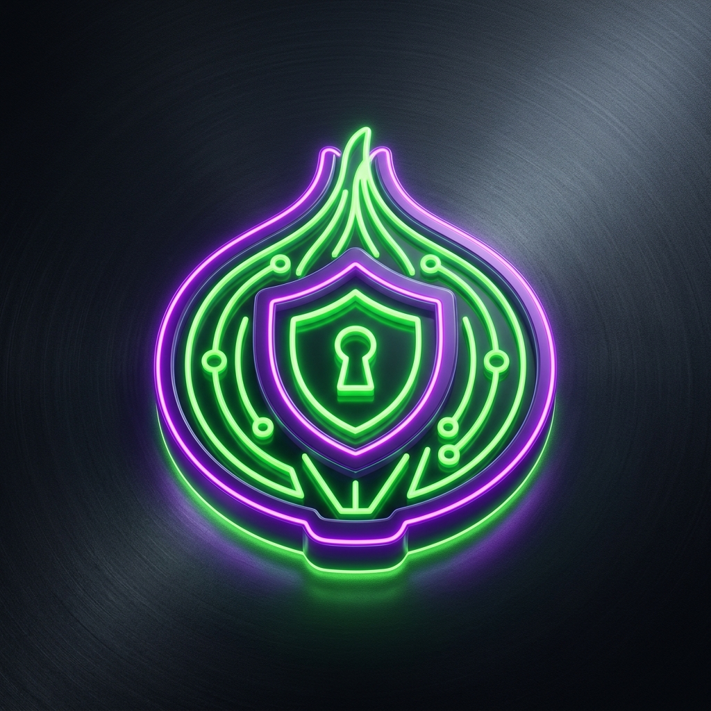
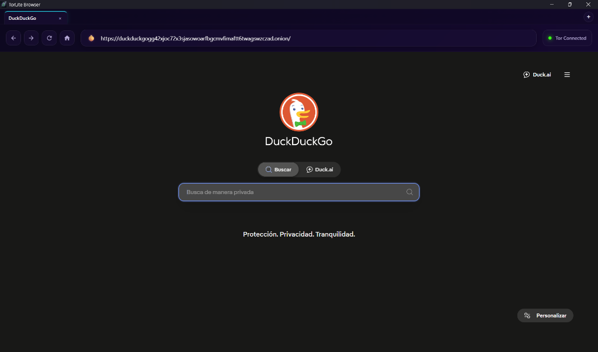
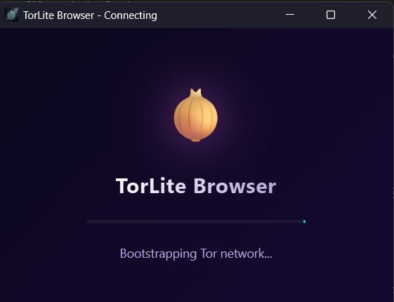

# TorLite Browser 🧅

[English Version](#english-version) | [Versión en Español](#versión-en-español)

---

# English Version

An experimental, lightweight, tabbed web browser built using **Tauri v2** and **Rust**, designed to route web traffic securely through the **Tor network** with a focus on amnesic privacy and multi-profile tab isolation.

<p align="center">
  
</p>

### Screenshots
<p align="center">
  
  &nbsp;&nbsp;&nbsp;&nbsp;
  
</p>

## Table of Contents
1. [Features](#features)
2. [Screenshots](#screenshots)
3. [Prerequisites](#prerequisites)
4. [Installation & Setup](#installation--setup)
5. [Building for Production (Distribution)](#building-for-production-distribution)
6. [Architectural Layout](#architectural-layout)
7. [Credits, Licenses & Copyrights](#credits-licenses--copyrights)
8. [License](#license)

### Features
- **Tor Integration**: Uses the official Tor Project's **Arti** client to bootstrap and connect directly to the Tor network.
- **Local SOCKS5 Proxy**: Spawns an internal SOCKS5 proxy server to route WebView2 traffic through Tor.
- **Tabbed Interface**: Supports multiple tabs in a single window with unified control, reload, back, forward, and address bars.
- **Multi-Profile Isolation**: Every tab is assigned its own unique data directory, meaning they do not share cookies, cache, or local storage.
- **Amnesic Data Cleanup**:
  - Automatically deletes a tab's profile directory from the disk 1 second after it is closed.
  - Automatically purges all stale profile directories on application startup, leaving no persistent browsing history, cache, or cookies.
- **Native Context Interception**: Intercepts native WebView2 new window requests (e.g., right-clicking a link and choosing "Open in new window" or target `_blank` clicks) and opens them as a new tab instead of a separate OS window.
- **Onion Status Indicator**: Glowing indicator that turns purple when visiting `.onion` hidden services and displays the real-time Tor bootstrap status.


### Prerequisites
To build and run this project, make sure you have the following installed:
1. **Rust & Cargo**: [Install Rust](https://www.rust-lang.org/tools/install) (nightly or stable).
2. **Node.js & npm**: [Install Node.js](https://nodejs.org/).
3. **Microsoft Edge WebView2**: (Pre-installed on Windows 10/11; otherwise, download the WebView2 Runtime).
4. **C++ Build Tools**: Required by Tauri on Windows (Visual Studio Build Tools with C++ workload).

### Installation & Setup
1. Clone or copy the project directory.
2. In the root directory, install the dependencies:
   ```bash
   npm install
   ```
3. Run the development server (watches files and rebuilds automatically):
   ```bash
   npm run tauri dev
   ```

### Building for Production (Distribution)
To compile a release version of the browser and package it for distribution, run:
```bash
npm run tauri build
```
Once the compilation finishes, Tauri will generate:
1. **Standalone Portable Executable (`.exe`)**: Found in `src-tauri/target/release/TorLite Browser.exe`. This is a single, self-contained file that runs immediately on double-click.
2. **Installer (`.msi`)**: Found in `src-tauri/target/release/bundle/msi/TorLite Browser_0.1.0_x64_en-US.msi`. 

**Note on self-containment**: The generated `.msi` and `.exe` are completely self-contained. Anyone you send them to can run the app without installing Rust, Node.js, npm, or Tor. On Windows 10/11, the browser engine (WebView2) is pre-installed. For older Windows editions, the MSI installer will automatically download it.

### Architectural Layout
- **`src-tauri/src/lib.rs`**: Main Rust backend managing the SOCKS5 proxy server loop, Tor bootstrapping via `arti-client`, child webview lifetime hooks, window event resizes, and native new window interception.
- **`src/bootstrap.html`**: A clean, animated splash screen that monitors the Tor connection status.
- **`src/index.html` & `src/styles.css`**: The modern glassmorphism browser layout, navigation controls, and tab bar.
- **`src/main.js`**: Frontend JS controller coordinating tab states, UI rendering, address bar inputs, and Tauri IPC commands.

### Credits, Licenses & Copyrights
This browser is built upon and makes use of the following open-source technologies:
- **Tauri Framework**: Licensed under either the [MIT License](https://github.com/tauri-apps/tauri/blob/dev/LICENSE-MIT) or the [Apache License, Version 2.0](https://github.com/tauri-apps/tauri/blob/dev/LICENSE-APACHE). [Website](https://tauri.app/).
- **Arti (Tor Client)**: Dual-licensed under the [MIT License](https://gitlab.torproject.org/tpo/core/arti/-/blob/main/LICENSE-MIT) and the [Apache License, Version 2.0](https://gitlab.torproject.org/tpo/core/arti/-/blob/main/LICENSE-APACHE). [Website](https://gitlab.torproject.org/tpo/core/arti).
- *Disclaimer: "Tor" and the "Onion Logo" are registered trademarks of The Tor Project, Inc. This project is an independent experiment and is not affiliated with or endorsed by The Tor Project.*
- **Wry (Webview Library)**: Licensed under either the [MIT License](https://github.com/tauri-apps/wry/blob/dev/LICENSE-MIT) or the [Apache License, Version 2.0](https://github.com/tauri-apps/wry/blob/dev/LICENSE-APACHE). [Website](https://github.com/tauri-apps/wry).

### License
This project is open-source and is licensed under the same dual-licensing scheme as Tauri and Arti: MIT License / Apache License, Version 2.0.

---

# Versión en Español

Un navegador web con pestañas, ligero y experimental construido usando **Tauri v2** y **Rust**, diseñado para enrutar el tráfico web de forma segura a través de la **red Tor** con un enfoque en la privacidad amnésica y el aislamiento de pestañas multi-perfil.

<p align="center">
  
</p>

### Capturas de Pantalla
<p align="center">
  
  &nbsp;&nbsp;&nbsp;&nbsp;
  
</p>

## Índice
1. [Características](#características)
2. [Capturas de Pantalla](#capturas-de-pantalla)
3. [Requisitos Previos](#requisitos-previos)
4. [Instalación y Configuración](#instalación-y-configuración)
5. [Compilación para Producción (Distribución)](#compilación-para-producción-distribución)
6. [Estructura del Proyecto](#estructura-del-proyecto)
7. [Créditos, Licencias y Derechos de Autor](#créditos-licencias-y-derechos-de-autor)
8. [Licencia](#licencia-1)

### Características
- **Integración con Tor**: Utiliza el cliente oficial **Arti** de The Tor Project para inicializar y conectarse directamente a la red Tor.
- **Proxy SOCKS5 Local**: Levanta un servidor proxy SOCKS5 interno para enrutar el tráfico de WebView2 a través de Tor.
- **Interfaz con Pestañas**: Soporta múltiples pestañas en una sola ventana con controles unificados de navegación, recarga, ir atrás, ir adelante y barra de direcciones.
- **Aislamiento Multi-Perfil**: A cada pestaña se le asigna su propio directorio de datos exclusivo, lo que significa que no comparten cookies, caché ni almacenamiento local.
- **Limpieza Amnésica de Datos**:
  - Elimina automáticamente el directorio de perfil de una pestaña del disco 1 segundo después de que se cierra.
  - Purga de forma automática todos los perfiles de pestañas antiguos al arrancar la aplicación, garantizando que no persistan historiales de navegación, caché o cookies entre sesiones.
- **Intercepción de Ventanas Nativas**: Captura las solicitudes de apertura de nuevas ventanas de WebView2 (como al pulsar "Abrir vínculo en una nueva ventana" en el menú contextual o enlaces con `target="_blank"`) y las abre como nuevas pestañas en la misma ventana.
- **Indicador de Estado Onion**: Distintivo brillante que se ilumina de color morado al visitar servicios ocultos `.onion` y muestra el progreso de conexión de Tor en tiempo real.


### Requisitos Previos
Para compilar y ejecutar este proyecto, asegúrate de tener instalado:
1. **Rust y Cargo**: [Instalar Rust](https://www.rust-lang.org/tools/install) (estable o nightly).
2. **Node.js y npm**: [Instalar Node.js](https://nodejs.org/).
3. **Microsoft Edge WebView2**: (Preinstalado en Windows 10/11; de lo contrario, descarga el WebView2 Runtime).
4. **Herramientas de Compilación de C++**: Requerido por Tauri en Windows (Visual Studio Build Tools con la carga de trabajo de C++).

### Instalación y Configuración
1. Clona o copia el directorio del proyecto.
2. En la carpeta raíz, instala las dependencias de Node:
   ```bash
   npm install
   ```
3. Ejecuta el servidor de desarrollo (compila e inicia la aplicación detectando cambios en tiempo real):
   ```bash
   npm run tauri dev
   ```

### Compilación para Producción (Distribución)
Para compilar la versión definitiva optimizada del navegador y empaquetarla para su distribución:
```bash
npm run tauri build
```
Una vez termine la compilación, Tauri generará:
1. **Ejecutable Portable Independiente (`.exe`)**: Ubicado en `src-tauri/target/release/TorLite Browser.exe`. Es un único archivo ejecutable autónomo listo para usarse con doble clic.
2. **Instalador (`.msi`)**: Ubicado en `src-tauri/target/release/bundle/msi/TorLite Browser_0.1.0_x64_en-US.msi`.

**Nota sobre la portabilidad**: El instalador `.msi` y el ejecutable `.exe` son completamente autónomos. Cualquier persona a la que se los envíes podrá ejecutar la aplicación directamente sin instalar Rust, Node.js, npm, ni Tor de forma externa. En Windows 10/11, el motor del navegador (WebView2) ya viene preinstalado de fábrica. En versiones anteriores de Windows que carezcan de él, el instalador MSI lo descargará automáticamente.

### Estructura del Proyecto
- **`src-tauri/src/lib.rs`**: Backend principal en Rust que maneja el bucle del servidor proxy SOCKS5, el arranque de Tor mediante `arti-client`, la gestión de ciclos de vida de webviews secundarios, el redimensionado de ventanas y la intercepción de nuevas ventanas nativas.
- **`src/bootstrap.html`**: Pantalla de carga animada que muestra el estado de inicialización y conexión a la red Tor.
- **`src/index.html` y `src/styles.css`**: Estructura de cabeceras en estilo glassmorphism moderno, barra de control, barra de pestañas y estilos CSS generales.
- **`src/main.js`**: Controlador JavaScript que gestiona el estado de las pestañas, renderizado dinámico de la UI, entradas de URL y llamadas IPC hacia Tauri.

### Créditos, Licencias y Derechos de Autor
Este navegador está construido sobre las siguientes tecnologías de código abierto:
- **Tauri Framework**: Licencia dual bajo [MIT License](https://github.com/tauri-apps/tauri/blob/dev/LICENSE-MIT) o [Apache License, Version 2.0](https://github.com/tauri-apps/tauri/blob/dev/LICENSE-APACHE). [Sitio Web](https://tauri.app/).
- **Arti (Cliente Tor)**: Licencia dual bajo [MIT License](https://gitlab.torproject.org/tpo/core/arti/-/blob/main/LICENSE-MIT) y [Apache License, Version 2.0](https://gitlab.torproject.org/tpo/core/arti/-/blob/main/LICENSE-APACHE). [Sitio Web](https://gitlab.torproject.org/tpo/core/arti).
- *Aviso legal: "Tor" y el logotipo "Onion" son marcas registradas de The Tor Project, Inc. Este proyecto es un experimento independiente y no está afiliado ni respaldado por The Tor Project.*
- **Wry (Biblioteca Webview)**: Licencia dual bajo [MIT License](https://github.com/tauri-apps/wry/blob/dev/LICENSE-MIT) o [Apache License, Version 2.0](https://github.com/tauri-apps/wry/blob/dev/LICENSE-APACHE). [Sitio Web](https://github.com/tauri-apps/wry).

### Licencia
Este proyecto es de código abierto y está licenciado bajo el mismo esquema dual que Tauri y Arti: Licencia MIT / Licencia Apache, Versión 2.0.
